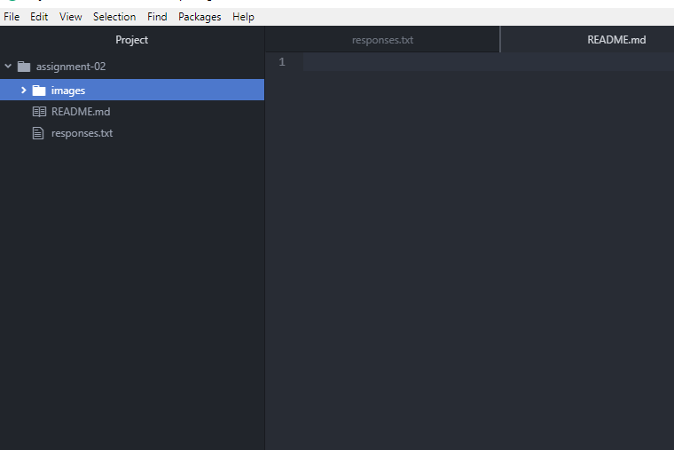

# Assignment 2
## Bethany Bea

I'm a journalism major and I decided to take this class because I need a few more upper-division credits to graduate, and web design is completely foreign to me. I figured in this world having even a little working knowledge in this area can only be helpful.

- I hope to better understand how computers work, in general.
- I hope to learn how to make a simple website.
- I already have a better grasp of how information gets around the internet.

[Longform](https://longform.org/)

[My Responses](./responses.txt)

